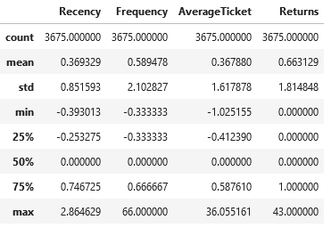

# Clusterização
## Introdução
Neste projeto, estaremos realizando a separação de um conjunto de dados entre *clusters* de clientes. O projeto completo, com as operações e modelos estão disponíveis em [clustering.ipynb](clustering.ipynb) e [clustering_part2.ipynb](clustering_part2.ipynb) (em inglês)

## Dados
Os dados vieram na forma de uma planilha contendo cada compra feita no *website* durante o período.

*Os dados brutos*

*Distribuição de preços de produtos na plataforma*

## Seleção de Features
Para realizar a clusterização, foram separadas algumas das *features* presentes nos dados. A primeira decisão foi excluir a coluna de países. Como a vasta maioria dos clientes são do Reino Unido, os clientes de outros países foram excluídos da clusterização para simplificar os dados e evitar efeitos relacionados a nacionalidade.

Analisando o resto das *features*, tentando encontrar variáveis que apresentassem uma boa distribuição e evitar redundância, chegamos a quatro *features*: Recência (numero de dias desde a última compra), Frequência (número de compras no período), Tíquete Médio e Número de Devoluções.

*Indicadores estatísticos das features*

## Seleção de Modelos
Foram consideredos três modelos de clusterização: K-Means, Gaussian Mixture e Hierarchical Clustering. Foram ajustados vários modelos para comparar seu desempenho com diferentes parâmetros.

